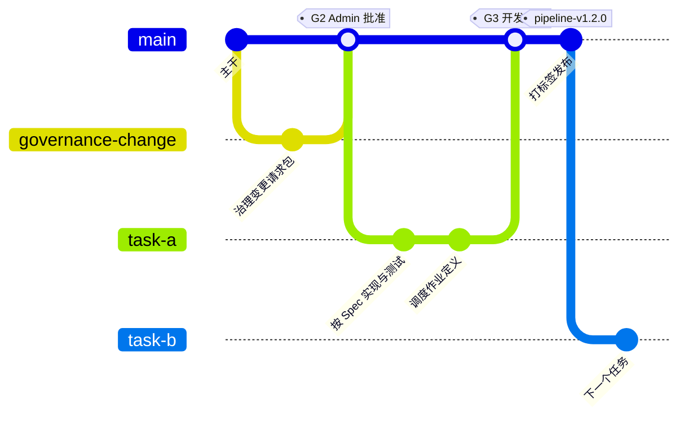
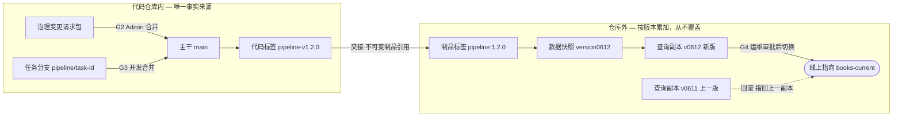
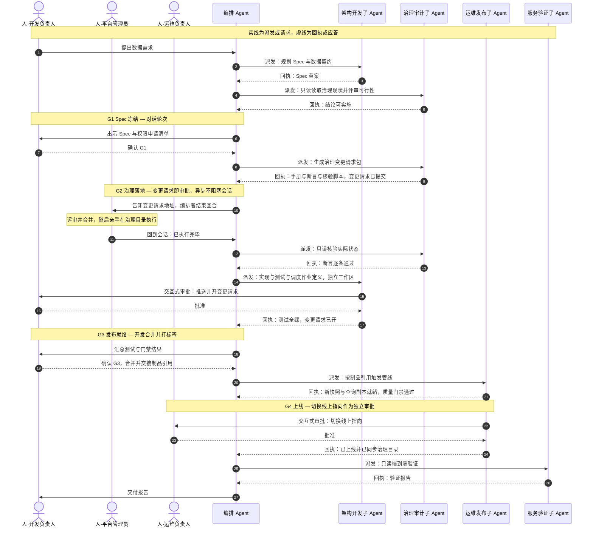
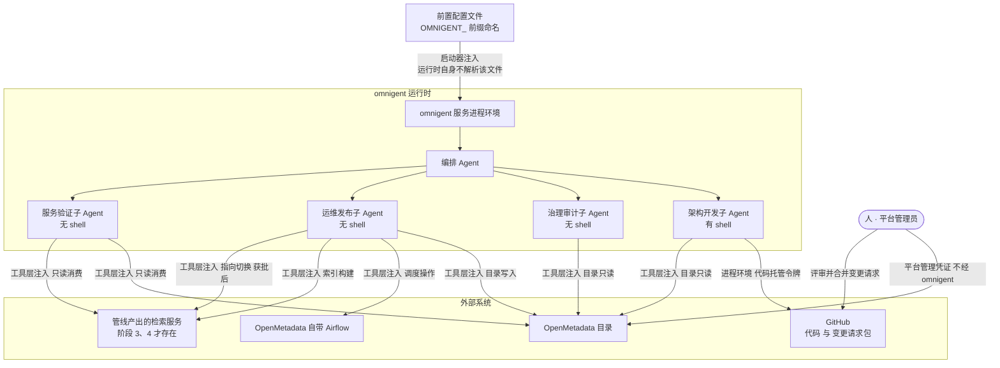

# Feature Specification: 数据管线生命周期 Agent

**Feature Branch**: `001-data-pipeline-agent`

**Created**: 2026-08-16

**Status**: Draft

**Input**: User description: "我要基于当前omnigent的agent接入模型自定义一个agent,用于数据管线的开发和线上服务,期望agent有如下功能:1) 支持基于openmetadata进行数据管线,数据服务的开发.可能包括3个子agent,subagent1是一个数据架构和开发agent,支撑根据用户期望需求进行spec规划,开发和测试,该agent基于omniagent的codex 进行定义和实现;subagent2是openmatadata的管理agent,负责om的资产域等相关高管线的资产创建和操作的审批,或者更加spec的需求进行创建;subagent3是一个使用管线服务的测试agent. 在docs/newfeatrues目录下的data-pipeline-lifecycle是一些说明和需要agent开发的具体例子. 规划并生成spec"

## Clarifications

### Session 2026-08-17

- Q: Agent 定义包(YAML)与它需要的自写策略函数(Python)放在哪个仓库、哪个位置? → A: YAML 放 `examples/pipely/`,自写策略函数放 omnigent 包内**新建的专用子包** `omnigent/policies/pipely/`
- Q: 一个工作会话对应什么范围? → A: 一个会话 = 一次流程实例;交付迭代(G1→G4)一个会话,日常每次运行另起会话
- Q: 新会话如何获得管线上下文? → A: 只传管线标识;git 存意图、OpenMetadata 存现状;G3 交接时把该版本的阈值与断言冻结进 OM 管线资产,无 shell 的运维 Agent 只读 OM 即可
- Q: 架构开发 Agent 开发期需要写元数据,写权限怎么给?bot 又该按什么粒度设? → A: 同一 OM 内划开发沙箱 Domain,架构开发 bot 的写权限由 OM 角色限定在该 Domain、对正式资产只读,正式登记仍归运维发布 Agent;bot 粒度为三个只读类全局共用、带写权限的运维发布 bot 按管线隔离
- Q: "次数为 0"式的合规指标如何验收? → A: 逐条转成测试用例,构造违规场景并断言被拒;运行期合规监控另立需求

## User Scenarios & Testing *(mandatory)*

本特性交付一个**面向 OpenMetadata 的数据管线生命周期编排 Agent**。用户用自然语言提出数据需求,编排者把工作拆给四个职责分明的子 Agent,覆盖 `docs/newfeatures/data-pipeline-lifecycle.html` 定义的五个阶段。

**对外只有两个前置依赖系统:OpenMetadata 与 GitHub。** OpenMetadata 同时提供**元数据管理**与**检索 MCP**,调度器则是它自带的 Airflow。全文中的"目录"指 OpenMetadata 目录,"调度器"指该 Airflow。

管线自己产出的检索服务与索引(参考实现中的语料检索 MCP、版本化查询副本)是**交付物,不是前置依赖**——它们在阶段 3、4 才被构建与部署,其地址与凭证由该管线的 Spec 定义,阶段 5 才被服务验证 Agent 消费。

### 三个人类角色

| 人类角色 | 职责 | 持有的凭证 | 把守的闸门 |
| --- | --- | --- | --- |
| **平台管理员 Admin** | 评审并合并治理变更请求包;**亲手执行**平台级治理操作;不参与日常管线 | 平台管理凭证(**任何 Agent 都不持有**) | G2 |
| **管线开发负责人** | 确认 Spec、评审并合并代码变更、批准开发过程中的推送 | 代码仓库评审与合并权 | G1、G3 |
| **管线运维负责人** | 批准上线切换、决定回滚、处理运行告警 | 生产运行审批权 | G4 |

数据需求方可以是上述任一角色,也可以是上游干系人;它是流程的输入方,不单独把守闸门。

### 四个子 Agent

**凭证边界即职责边界。** 四个子 Agent 的能力按"最小够用"裁剪,尤其是:**没有任何 Agent 持有平台管理凭证**。

| 子 Agent | 对应阶段 | 职责 | 凭证 | 有 shell |
| --- | --- | --- | --- | --- |
| **架构开发** | 1、3 | Spec 规划、代码与测试、调度作业**定义**、开变更请求 | 代码仓库写、OpenMetadata bot(**正式目录只读;开发沙箱 Domain 内可写**) | 有,限于其工作区 |
| **治理审计** | 1、2 | 平台可行性评审、生成治理变更请求包、**人执行后只读核验**、漂移检测 | OpenMetadata **只读** | 无 |
| **运维发布** | 4 | 触发 Airflow 作业、判定质量门禁、上线切换、回滚、同步运行状态 | Airflow 操作、索引构建、线上指向、OpenMetadata **Writer** | 无 |
| **服务验证** | 5 | 以最终用户视角只读消费管线服务 | 仅只读 | 无 |

两条关键分界:

- **治理审计子 Agent 不执行任何治理写操作。** 阶段 2 的操作简单但权限极高、每条管线只做一次——自动化收益小、风险大。它改为产出可执行的变更请求包,由平台管理员亲手执行,Agent 只在事后做只读核验。
- **调度作业的"定义"与"运行"分属两个 Agent。** 作业定义是代码,由架构开发子 Agent 编写并走变更请求;作业运行是操作,由运维发布子 Agent 触发与监控,它**够不着源码**。

---

### User Story 1 - 从模糊需求到可评审的 Spec (Priority: P1)

数据需求方用自然语言描述想要什么(例如"我要能按学科筛选检索这批书目"),编排者派给架构开发子 Agent。该子 Agent 追问缺失信息,勘察数据源,产出一份**统一 Spec**:数据契约、字段定义、质量阈值、验收用例、分层设计、治理资产模型、角色分工、版本与回滚策略,以及一份**权限申请清单**。治理审计子 Agent 用只读权限读取治理目录现状,对该 Spec 做平台可行性与权限边界评审,给出可实施或需修改的结论。

**Why this priority**: 这是整条链路的输入,也是唯一能独立交付价值的最小切片——即使后续阶段都不自动化,一份条目完整、可评审的 Spec 本身就替代了当前最耗人力的环节。它同时是后面所有阶段的验收基准:没有 Spec 就没有"做对了"的定义。

**Independent Test**: 给定一个自然语言数据需求和一份可访问的数据源样本,运行编排者,检查产出的 Spec 是否包含全部必备条目、每条质量阈值是否可量化、每条验收用例是否可执行、权限申请清单是否覆盖设计中每一个需要授权的动作。全程不创建任何治理资产、不写入任何数据。

**Acceptance Scenarios**:

1. **Given** 一个自然语言数据需求和一份可读取的原始数据样本,**When** 用户请求规划,**Then** 系统产出一份统一 Spec,其中数据契约、字段定义、质量阈值、验收用例、分层设计、治理资产模型、版本与回滚策略、权限申请清单八类条目全部非空。
2. **Given** 需求描述中缺少更新频率与数据规模,**When** 系统开始规划,**Then** 系统在产出 Spec 之前就这些缺口提问,而不是静默填入默认值。
3. **Given** 一份 Spec 要求一项当前平台不具备的能力,**When** 治理审计子 Agent 评审,**Then** 结论明确指出该项不可行及原因,且 Spec 状态不进入"可实施"。
4. **Given** 需求在评审后被修改,**When** 用户请求更新,**Then** 系统修订同一份 Spec 并保留可追溯的变更记录,而不是另起一份互相矛盾的文档。
5. **Given** Spec 条目齐备且评审结论为"可实施",**When** 系统准备进入治理落地,**Then** 系统停在 G1 闸门,向管线开发负责人出示 Spec 与权限申请清单,在其确认前不生成变更请求包。
6. **Given** 前置配置中缺少若干必需凭证,**When** 用户发起第一个请求,**Then** 系统在派发任何任务之前一次性列出全部缺失项及其对应 Agent,并停止流程,而不是先跑起来再在中途失败。
7. **Given** 架构开发子 Agent 具备 shell 能力,**When** 它读取自身进程环境,**Then** 它只能读到模型访问与代码托管两项凭证;目录写入、调度操作、指向切换、平台管理等凭证均不在其中。
8. **Given** 工作会话未共享给平台管理员,**When** 流程启动,**Then** 系统在派发任何任务前报出"闸门待办无法送达"并指明缺失的共享对象,而不是等到 G2 时才发现管理员的收件箱是空的。
9. **Given** 会话已共享给运维负责人但未为其委派审批权,**When** 流程启动,**Then** 系统报出该项缺失,并把它与"未共享"区分开——前者看不到待办,后者看得到却点不动。
10. **Given** 引导用的只读 bot 尚未由平台管理员创建,**When** 系统启动,**Then** 系统明确报出该 bot 缺失并停止,不尝试自行创建。
11. **Given** 治理审计 bot 被误授了写权限,**When** 启动自检执行写操作负向探测,**Then** 探测**未被拒绝**这一事实被判定为自检失败,系统拒绝启动并指明该 bot 多出了写权限。
12. **Given** 全部 bot 权限配置正确,**When** 启动自检执行,**Then** 只读 bot 的写探测被 OpenMetadata 拒绝、各 bot 的应有权限可用,自检通过且未对目录产生任何实际变更。

---

### User Story 2 - 治理变更由人执行,Agent 只出手册与核验 (Priority: P2)

治理审计子 Agent 依据已冻结的 Spec,并**读取治理目录的实时状态**(现有业务域、命名冲突、当前策略),产出一份**治理变更请求包**:逐步操作手册、执行后应达到的状态断言、只读核验脚本。这份包以变更请求的形式提交到代码仓库——**变更请求本身就是审批载体**。平台管理员评审并合并,然后**亲手**在治理目录与检索平台执行。执行完成后,治理审计子 Agent 以只读权限核验实际状态是否与断言一致,核验通过才算过闸。

**Why this priority**: 这是安全边界的落点,也是本设计与"让 Agent 拿管理员凭证"的分水岭。它可以在管线代码一行都没写时独立交付。换成人执行之后,最大的风险不再是"Agent 建错",而是"人照手册执行错了且无人发现"——只读核验正是为了闭上这个环,而它不需要任何写权限。

**Independent Test**: 给定一份已冻结的 Spec 和一个治理目录实例,运行治理审计子 Agent,检查变更请求包三件产物齐备、手册每步都带核验方式与回滚步骤、断言可机器判定;人为在执行时漏做一步,验证核验能准确指出缺失项并阻止闸门通过;全程验证该子 Agent 未发起任何写操作。

**Acceptance Scenarios**:

1. **Given** 一份已冻结的 Spec,**When** 治理审计子 Agent 生成变更请求包,**Then** 产出操作手册、状态断言与只读核验脚本三件产物,手册的每一步都含操作、参数、预期结果、核验方式与回滚步骤。
2. **Given** 治理目录中已存在与 Spec 命名冲突的资产,**When** 子 Agent 生成手册,**Then** 手册基于实时状态标出该冲突并给出处置选项,而不是照 Spec 生成一份注定失败的手册。
3. **Given** 变更请求包已提交,**When** 流程推进,**Then** 该待办出现在**平台管理员本人的收件箱**中,即便该会话由开发负责人发起、管理员从未打开过它。
4. **Given** 平台管理员已合并变更请求并按手册在 OpenMetadata 执行完毕,**When** 他在收件箱点击确认,**Then** 该确认触发治理审计子 Agent 的只读核验,逐条比对断言并输出通过或失败清单,失败项指明期望值与实际值。
5. **Given** Spec 要求运维发布与服务验证两个 bot,**When** 治理审计子 Agent 生成变更请求包,**Then** 创建这两个 bot 并授予角色作为平台级操作被写入手册,交由平台管理员亲手执行;Agent 自身不创建任何 bot、不授予任何角色。
6. **Given** 核验发现任一断言不满足,**When** 流程继续,**Then** G2 闸门不通过,系统不进入开发阶段,并给出需要补做的具体步骤。
7. **Given** 治理审计子 Agent 在任何环节尝试写入治理目录,**When** 请求发出,**Then** 操作被拒绝——它的凭证与工具集从结构上不具备写能力。
8. **Given** 同一份变更请求包被重复核验,**When** 核验执行,**Then** 结果一致且不产生任何副作用。
9. **Given** 平台管理员在代码仓库中不具备评审与合并权限,**When** 流程准备生成变更请求包,**Then** 系统在生成前就报错并指明该前提不成立,而不是产出一份无人能批的变更请求。

---

### User Story 3 - 管线实现、质量门禁与交接 (Priority: P3)

架构开发子 Agent 按 Spec 在代码仓库中实现数据处理、服务、治理同步与**调度作业定义**。它**以只读身份访问 OpenMetadata**,查询数据源定义、管线中间表与落地表的结构与归属——没有这层访问,它无从按真实 schema 开发。它编写并跑通自动化测试,在独立工作区与任务分支中工作,完成后开变更请求。管线开发负责人评审并合并,打标签发布,产出**不可变的制品引用**(代码标签 + 制品标签)。这个制品引用就是交给运维发布子 Agent 的全部内容——运维侧不接触源码。

**Why this priority**: 这是产出实际管线代码的环节,依赖 US1 的 Spec 与 US2 的治理空间。它以"交接制品引用"结束,而不是以"上线"结束——上线是下一条故事,由另一个 Agent、另一个人类角色负责。

**Independent Test**: 给定一份 Spec 和已核验通过的治理空间,运行开发流程,验证:每条验收用例都有对应的自动化测试且全绿;子 Agent 写入未越出工作区;Agent 未自行合并变更请求;合并后产出的制品引用可被独立解析,且不包含任何指向源码工作区的路径。

**Acceptance Scenarios**:

1. **Given** 一份可实施的 Spec,**When** 架构开发子 Agent 执行开发,**Then** 产出的代码带有覆盖 Spec 中每条验收用例的自动化测试,且测试全部通过。
2. **Given** 需要调度编排,**When** 子 Agent 开发,**Then** 调度作业定义作为代码产出并纳入同一变更请求,与实现和测试一同评审。
3. **Given** 子 Agent 尝试写入其工作区之外的路径,**When** 写入发起,**Then** 操作被拒绝,且该子 Agent 的其他在途任务不受影响。
4. **Given** 开发完成需要推送并开变更请求,**When** 子 Agent 发起,**Then** 该操作作为一次交互式审批送达管线开发负责人,获批后才执行。
5. **Given** 自动化测试全绿且变更请求已开,**When** 编排者收到完成回执,**Then** 系统停在 G3 闸门,汇总测试结果并结束回合等待人确认,**不自行合并**变更请求。
6. **Given** 管线开发负责人合并变更请求并打标签,**When** 交接发生,**Then** 交给运维侧的是不可变的制品引用,**不含**分支名、工作区路径或任何可写源码位置。
7. **Given** 用户要求变更架构或范围,**When** 变更开始,**Then** 系统先修改 Spec 再修改实现与测试,拒绝在 Spec 未更新时直接改实现。
8. **Given** 一个私有仓库与已配置的 git 凭证,**When** 架构开发子 Agent 先克隆、再在任务过程中拉取与推送,**Then** 三个动作全部认证成功,且工作区与磁盘上不留下任何凭证文件。
9. **Given** 授予 Agent 的代码托管令牌不具备合并权限,**When** 子 Agent 尝试合并自己开出的变更请求,**Then** 托管服务拒绝该操作——"Agent 不合并"由凭证层强制,不依赖提示词。
10. **Given** 未配置 git 凭证,**When** Agent 访问一个公共仓库,**Then** 匿名克隆正常工作,不因缺少凭证而失败。
11. **Given** Spec 引用了若干数据源与落地表,**When** 架构开发子 Agent 开发,**Then** 它能从 OpenMetadata 读到这些对象的结构与归属;而它尝试写入 OpenMetadata 时被拒绝——其 bot 只有读权限。

---

### User Story 4 - 上线、质量门禁与运维 (Priority: P4)

运维发布子 Agent 拿到制品引用后接管运行面:按计划或数据到达事件触发管线,生成新的**不可变数据快照**与对应的**版本化查询副本**,执行质量门禁(记录数、异常率、结构一致性、黄金用例、查询性能)。门禁通过后,把切换线上指向作为一次**独立的交互式审批**送达管线运维负责人;获批才切换,门禁失败则保持旧版本在线。上线后把版本、计数、质量与运行状态同步回治理目录。失败时告警,必要时回滚。

**Why this priority**: 这是真正影响线上服务的环节,风险最高,因此单独成一条故事、单独一个 Agent、单独一个人类角色。把它与开发合并会让同一个 Agent 同时握有"改代码"和"改生产"的权力,可以绕过全部评审——这是本设计明确排除的。

**Independent Test**: 给定一个制品引用和已初始化的治理空间,运行运维发布子 Agent,验证:新快照未覆盖旧快照;门禁每项都有实际值与阈值的对比;人为制造一项门禁失败时线上指向不变;上线切换确实经过独立审批;回滚后线上指向恢复且数据可查;全程验证该子 Agent 无法读写源码。

**Acceptance Scenarios**:

1. **Given** 一个制品引用,**When** 运维发布子 Agent 执行管线,**Then** 新快照以新版本标识存放,旧快照与旧查询副本均未被修改或删除。
2. **Given** 质量门禁中任意一项未达 Spec 阈值,**When** 发布步骤执行,**Then** 线上指向不切换,旧版本继续对外服务,失败项及其实际值被报告。
3. **Given** 门禁全部通过,**When** 系统准备切换线上指向,**Then** 该切换作为一次独立的交互式审批送达管线运维负责人,在获批前线上指向保持不变。
4. **Given** 一次已完成的上线,**When** 运维负责人要求回滚,**Then** 线上指向在约定时限内指回上一个查询副本,且该版本数据可正常查询,过程不重建数据、不回退代码。
5. **Given** 上线完成,**When** 治理同步执行,**Then** 目录中记录的版本、记录数、质量结果、血缘与运行状态与实际部署一致。
6. **Given** 管线被按计划或按数据到达事件触发,**When** 上游数据自上次运行以来无变化,**Then** 流程尽早结束,不生成新版本、不改动线上指向,并报告"无变化"。
7. **Given** 运维发布子 Agent 尝试读取或修改管线源码,**When** 请求发出,**Then** 操作被拒绝——它的工具集不含文件与 shell 能力。
8. **Given** 出现连续失败、结构破坏性变更或权限错误,**When** 检测到,**Then** 系统告警;仅当涉及平台对象或授权策略变更时才升级到平台管理员。
9. **Given** 运维发布子 Agent 尝试部署一份不在制品引用范围内的作业定义,**When** 部署发起,**Then** 操作被拒绝——它只能部署已评审、已合并、已打标签的那一份。
10. **Given** 运维发布子 Agent 持有调度器操作凭证,**When** 它尝试用该凭证执行治理目录的平台级操作,**Then** 操作被拒绝——调度凭证与平台管理凭证是分离的两套。

---

### User Story 5 - 以最终用户视角验证线上服务 (Priority: P5)

服务验证子 Agent **只持有只读凭证**,像真实使用者一样消费已发布的管线服务:区分"问定义与治理"还是"问具体数据",分别路由到 OpenMetadata 与**管线自己产出的检索服务**;遇到术语歧义先查词表再检索;返回的每条结果都带可解释的命中原因;不暴露内部路径类字段;分页受限。它同时是权限边界的活体检验——任何写操作都必须失败。

**Why this priority**: 这是交付质量的最终确认,也是最容易被跳过却最能暴露问题的一环(权限泄漏、字段泄漏、语义路由错误)。它依赖前四条故事的产出,故优先级最低,但缺了它就没有"能用"的证据。

**Independent Test**: 只注入只读凭证启动服务验证子 Agent,给出一组混合问题(定义类、检索类、歧义术语类、越权类),验证路由正确、结果可解释、内部字段不出现、分页上限生效,且每一次写尝试都被拒绝。

**Acceptance Scenarios**:

1. **Given** 一个关于字段含义或归属的问题,**When** 服务验证子 Agent 处理,**Then** 它从治理目录取答案,而不是猜测或从数据查询服务拼凑。
2. **Given** 一个包含歧义或同义术语的检索请求,**When** 子 Agent 处理,**Then** 它先查询受控词表消歧,再执行检索,并在结果中说明采用了哪个术语。
3. **Given** 任意检索结果,**When** 返回给用户,**Then** 每条结果包含唯一标识、标题、命中条件和命中原因,且不包含内部路径类字段。
4. **Given** 子 Agent 尝试任何写入、索引创建或线上指向切换操作,**When** 请求发出,**Then** 操作被拒绝,且失败信息不泄漏凭证内容。
5. **Given** 一次返回结果数超过约定上限的检索,**When** 子 Agent 处理,**Then** 它使用分页而不是一次性拉取全部结果。

---

### Edge Cases

- **子 Agent 无法启动**:某个子 Agent 依赖的运行环境在当前机器上不存在时,编排者必须在派活前发现并明确告知哪个能力不可用,而不是反复重试或静默降级。
- **变更请求包久未处理**:治理变更请求是异步的,可能数天无人处理。系统必须能在人回到会话时准确恢复上下文,且不得为此轮询或长期挂起会话。
- **人执行手册时漏做或做错**:只读核验必须能逐条指出缺失与偏差,而不是只给"通过/不通过"。
- **手册基于的实时状态在执行前发生变化**:核验失败时,系统必须能重新生成手册而不是让人反复试错。
- **交互式审批超时或审批人不在**:按未批准处理,不默认放行;已获批的其他操作不受牵连。
- **质量门禁临界通过**:阈值判定必须给出实际值与阈值的对比,避免"刚好通过"被当作无风险。
- **结构破坏性变更**:上游字段被删除或类型变更时,系统必须报警并停在门禁前,不得自动放行到线上。
- **治理目录与实际部署漂移**:目录记录的版本与线上实际服务版本不一致时,系统必须能检出并报告,而不是以目录为准盲信。
- **重复执行**:任一阶段重复执行都不得产生重复资产、覆盖旧快照或破坏线上指向。
- **凭证越界**:任一子 Agent 若被错误地注入了超出其职责的凭证,系统必须拒绝以该身份启动,而不是"能用但不用"。
- **上游数据无变化**:调度触发但数据未变时,流程应尽早结束,不生成空版本。
- **服务不可达**:治理目录或数据查询服务临时不可达时,区分"暂时性故障可重试"与"配置错误需人工介入",不把两者报成同一种失败。
- **调度器与治理目录同源**:二者属同一套部署,升级或故障会同时影响元数据与作业执行。系统必须能分别报告两者的可用性;同时,管线作业的资源占用不得拖垮该部署原有的元数据采集任务。
- **凭证在运行中过期或被轮换**:系统必须指明是**哪一项**凭证失效,而不是笼统报成"目标系统不可达"——两者的处置方式完全不同。
- **bot 权限在运行期间被人改宽**:启动自检只能覆盖启动那一刻。若 bot 角色在运行中被调整,系统至少要在下次启动时检出;更强的做法是在每轮关键操作前复检,由规划阶段权衡代价。
- **引导 bot 与后续 bot 的顺序被颠倒**:若管理员先建了带写权限的 bot 而漏了引导用的只读 bot,治理审计 Agent 无法读取目录现状,流程必须在此明确失败,而不是退化成基于 Spec 猜测生成手册。
- **平台管理员不是代码仓库协作者**:变更请求包的审批载体因此失效,系统必须在流程开始前就发现该前提不成立并明确报错,而不是生成一份无人能批的变更请求。

## Requirements *(mandatory)*

### 实现载体:一切能力由 omnigent 的 Agent 定义承载

**本特性交付的是一个 Agent 定义包,不是一套应用程序。** 全文中的"系统"指的是这个包。

**交付位置**:Agent 定义(YAML 与 skills)放在 `examples/pipely/`——该目录已是本仓库分发 Agent 包的既有路径。**自写策略函数放在 omnigent 包内新建的专用子包** `omnigent/policies/pipely/`。

策略函数**不能**放在 `examples/` 下,这是硬性限制而非偏好,三条证据:`examples/` 与其下的 Agent 目录**都没有 `__init__.py`**,不是 Python 包;已有目录名含连字符(如 `deep-research`),连字符不是合法 Python 标识符;打包时 `examples/` 被当作**资源**处理,资源目录不在导入路径上。而策略以**点分导入路径**引用,必须能被运行时 `import`——放错位置,FR-090 与 FR-091 会静默失效。

选新建专用子包而非并入 `omnigent/policies/builtins/`,是为了与上游内置策略分开:纯新增目录不触碰上游任何文件,变基时冲突面最小,职责也更清晰。

```
examples/pipely/                          ← Agent 定义(资源,不在导入路径上)
├── config.yaml                           编排者:prompt、executor、tools.agents、guardrails
├── agents/<name>/config.yaml             四个子 Agent 各自的 executor、prompt、os_env、policies
├── tools/mcp/<name>.yaml                 OpenMetadata / Airflow 接入与凭证注入
└── skills/<name>/SKILL.md                可复用的流程手册

omnigent/policies/pipely/                 ← 自写策略函数(可 import)
├── gates.py                              闸门状态机(FR-090)
└── preflight.py                          前置条件校验(FR-091)
```

凡是这些机制表达不了的能力,只有三种下场:退化成提示词里的一句话(**弱强制**)、落到部署侧配置(**不在包内**)、或者根本没有载体。**必须逐条认领载体,不能默认"写进需求就等于实现了"。** 这一点对本特性尤其要命——它通篇的主张就是"在凭证层与策略层强制,而不是靠提示词自觉"。

#### 需求分三层读,不可混为一谈

现有功能需求实际上跨了三个层次,规划时必须分开处理:

| 层次 | 是什么 | 载体 | 例 |
| --- | --- | --- | --- |
| **① Agent 长什么样** | Agent 定义包本身的构造 | 声明式配置 | 四个子 Agent、有无 shell、MCP 接入、凭证注入 |
| **② Agent 怎么工作** | 运行时行为与边界 | 策略函数 + skills + prompt | 闸门顺序、审批、工作区隔离、交接契约 |
| **③ Agent 产出的管线长什么样** | 管线代码的要求 | **不由本包实现**——是 Agent 运行时按 Spec 去写的东西 | 快照不覆盖、质量门禁项、回滚、幂等 |

**第 ③ 层是 Agent 的验收标准,不是 Agent 的构建规格。** 把它们当成"要在 Agent 定义里实现的功能"会让规划严重跑偏——它们应当成为 Agent 的 prompt/skill 里给出的**开发契约**,以及每条管线 Spec 的验收用例。

#### 载体认领

| 能力 | 载体 | 强制力 |
| --- | --- | --- |
| 四个子 Agent 与各自 harness | `tools.agents` + `agents/*/config.yaml` | **强**(声明式) |
| 有无 shell | 声明 / 不声明 `os_env` | **强**(不声明即无该类工具) |
| 工作区写入隔离 | 内置工作区守卫策略 | **强** |
| 不可恢复操作拒绝、推送/部署需审批 | 内置爆炸半径策略 | **强** |
| 每轮派发上限、子 Agent 用途白名单 | 内置编排策略 | **强** |
| 只读子 Agent 不得改文件 | 内置只读策略 + 不授予写工具 | **强** |
| OpenMetadata / Airflow 接入与凭证 | `tools/mcp/*.yaml`(变量引用 + 工具白名单) | **强** |
| 会话共享能力 | `agent_session_sharing: non-public` | **强** |
| 审批时限 | `guardrails.ask_timeout`(可按策略覆盖) | **强** |
| **闸门顺序不可跨越** | **自定义策略函数** + 会话标签状态 | **强**(见下) |
| **前置条件校验**(凭证、共享、审批权、bot 权限) | **自定义策略函数**,在首个工具调用前拦截 | **强**(见下) |
| **确定性计算逻辑**(如断言比对、门禁判定) | **Python 函数工具**(`type: function` + `callable:`) | **中**(见下) |
| 五阶段流程编排、手册与报告结构 | prompt + skills | **弱**(靠模型遵守) |

#### 四层强制力,不可混用

这四种机制的强制力**依次递减**,选错载体等于没做:

| 机制 | 运行时行为 | 强制力 |
| --- | --- | --- |
| **策略**(`guardrails.policies`) | 每次工具调用/结果**无条件求值**,模型没有选择权 | **强** |
| **确定性工具 + 结果策略**(函数工具 + 在工具结果上求值的策略) | 工具执行确定性代码;策略读**工具的真实返回值**并落状态,后续操作凭该状态放行 | **强**(见下) |
| **工具集裁剪** | 未授予的工具模型根本调不到 | **强** |
| **Python 函数工具**(单用) | 一旦被调用,执行的是确定性代码;**但调不调用由模型决定** | **中** |
| **skill 捆绑脚本**(`skills/<name>/scripts/`) | 可被列出与读取,**但没有"执行 skill 脚本"的工具**——要跑得由 Agent 自己经 shell 调用 | **弱** |
| **skill 正文 / prompt** | 模型主动调用加载工具才会读到,读到也未必遵守 | **弱** |

#### 把能力定制成工具,是三个不同层面的机制

"做成工具"不是单一手段,它同时提供三层约束,强度各异:

| 层面 | 含义 | 强制力 |
| --- | --- | --- |
| **工具集即能力边界** | 未授予的工具,模型根本调不到——这是最强也最省事的一道 | **强** |
| **工具内部逻辑** | `callable:` 指向的代码写死了"怎么做",模型无从改变 | **强**(一旦调用) |
| **是否调用** | 由模型决定 | **弱**(单独看) |

**第三层的弱点可以被策略补上,而且能防谎报。** 策略有六个触发点,其中两个是关键:`tool_call`(派发**前**,可拒绝)与 `tool_result`(工具返回后、**结果回给模型之前**,能读到真实返回值)。由此可组出闭环:

1. Agent 调用确定性工具(如"只读核验");
2. 策略在 `tool_result` 上读**工具的真实返回值**,据此写会话标签;
3. 后续操作在 `tool_call` 上被策略检查该标签,不满足即拒绝。

**关键在于策略读的是工具的真实返回值,而不是模型的自述——所以模型声称"我已经核验过了"没有用。** 这一组合把"必须做、且必须做成功"变成了硬约束,是本特性中一切"证明某步骤确实发生"的需求应采用的载体。

两条必须记住的分界:

- **"确定性执行"≠"必然被执行"。** 单用函数工具消除了"模型瞎编结果"的风险,但**是否调用仍由模型决定**;要补上这一层,必须配 `tool_result` + `tool_call` 策略。**禁止类约束("不能做 X")落策略;"必须做且做成"落工具+策略组合;纯计算逻辑才可单用函数工具。**
- **skill 只承载"怎么做"的知识,承载不了"必须做"的约束。** 运行时**没有强制加载 skill 的机制**,skill 是模型主动调用加载工具才读到的。把流程约束写进 skill,等于写进提示词。

还有一条容易踩的坑:**三个无 shell 的子 Agent 跑不了任何脚本。** skill 的 `scripts/` 目录对它们形同虚设——它们没有 shell,无法执行读到的脚本。这三个 Agent 需要的任何确定性逻辑,**只能以 Python 函数工具提供**。只有架构开发子 Agent 有 shell,能跑捆绑脚本。

两处需要**自己写策略函数**,不能靠现成能力:

- **闸门状态机**:策略可读写会话级标签,且在审批场景下**仅在批准时**才落状态。因此可以用一个标签记录当前闸门,策略拒绝任何越序操作——这是真强制,不是提示词。
- **前置条件校验**:运行时**没有** Agent 启动自检钩子(现有范例的"首轮预检"是写在提示词里、靠模型自觉的)。要让 FR-060、FR-074、FR-083 这类校验成为硬约束,只能写一个策略函数在首个工具调用上拦截。

#### 不在本包内的部分

以下必须完成,但**不属于 Agent 定义包**,须在部署文档与示例配置中交代清楚:环境变量文件各项凭证;OpenMetadata bot 的创建与角色授予;代码托管令牌不授予合并权限;会话共享与审批权委派;OpenMetadata 与 Airflow 的部署本身。

### 阶段与闸门模型

职责仍按源文档的五个阶段划分,人工闸门设**四道**。闸门是"流程可否推进"的确认,与单个危险操作的审批是两回事,不可互相替代。

| 闸门 | 位置 | 通过条件 | 把守人 | 走哪条通道 |
| --- | --- | --- | --- | --- |
| **G1 Spec 冻结** | 阶段 1 → 2 | Spec 条目齐备、可行性评审结论为"可实施"、权限申请清单已确认 | 管线开发负责人 | 对话轮次 / 收件箱 |
| **G2 治理落地** | 阶段 2 | 变更请求包已合并、平台管理员已手工执行、**只读核验通过** | 平台管理员 | **收件箱**待办 + 变更请求包作载体 |
| **G3 发布就绪** | 阶段 3 → 4 | 测试全绿、代码变更请求已合并并打标签、制品引用已产出 | 管线开发负责人 | 收件箱提醒 + 在托管服务审阅差异 |
| **G4 上线** | 阶段 4 内 | 新版本已构建、质量门禁全绿,仅剩切换线上指向 | 管线运维负责人 | **收件箱**待办 |

**阶段 5 不设闸门**:只读消费,是 G4 之后的验证动作。

**一个会话 = 一次流程实例。** 闸门状态靠会话级标签记录,因此流程实例的边界就是会话的边界:**交付迭代**(G1→G4 走完即结束)一个会话;阶段 4 的**日常运行**是重复触发、无人值守的,每次运行另起会话。若把两者塞进同一会话,后续每次运行都会反复改写闸门标签,状态机随即失效;会话共享的可见范围也会失控。

### 版本与分支约束

数据管线有**多类互相独立的版本**,不得用同一个标识兼表两类。这是本特性与普通应用最大的差别:

| 版本类别 | 标识形式 | 产生时机 | 产生方 |
| --- | --- | --- | --- |
| 代码版本 | 代码仓库标签 | G3 合并后 | 管线开发负责人 |
| 制品版本 | 构建产物标签 | G3 后构建 | 架构开发子 Agent |
| 数据快照版本 | 快照版本号 | 阶段 4 每次运行 | 运维发布子 Agent |
| 查询副本版本 | 含快照版本号的副本名 | 阶段 4 | 运维发布子 Agent |
| 线上指向 | 稳定别名 | G4 切换 | 运维发布子 Agent(获批后) |

**"开发测试管线"与"线上管线"不靠长期分支区分。** 同一主干、同一份代码,区别只在于:跑的是哪个数据快照版本,以及线上指向当前指向哪个查询副本。因此回滚是把指向指回上一个副本,既不回退代码也不重建数据(见 FR-024)。长期存在的环境分支会让"线上跑的是哪版代码"与"线上指向谁"这两个事实产生第二个真相源,是本特性明确排除的做法。

#### 图 2 · 分支流转



**变更请求是两类审批的共同载体**:治理变更请求包由平台管理员批准合并(G2),代码变更由管线开发负责人批准合并(G3)。两条路径都落在同一主干上,审批记录、署名和讨论线程复用同一套已被组织信任的机制。

分支实际命名为 `pipeline/<task-id>` 与 `governance/<change-id>`,一个分支对应一个独立工作区,子 Agent 的写入被限制在该工作区子树内(FR-036)。**Agent 不合并**(FR-039)。**没有 develop / release / prod 这类长期分支**:环境差异不在代码里。

#### 图 3 · 版本产物与仓库边界



这张图说明本特性最容易做错的一点:**代码版本与数据版本是两条独立的轴**。仓库里只有"如何生成",产物在仓库外按版本累加且从不覆盖;"哪个版本在线"既不是分支状态也不是标签状态,而是**线上指向**的状态,因此回滚只动最右边那一步。图中标注的"交接"是 G3 到 G4 的唯一通路——运维侧只拿到制品引用,拿不到源码位置(FR-040)。

### 交互通道约束

四条通道职责不重叠,任何一条都不能替代另一条:

| 通道 | 语义 | 用途 | 响应方 | 时间尺度与阻塞性 |
| --- | --- | --- | --- | --- |
| **任务回执** | 机器对机器 | 子 Agent 完成 → 唤醒编排者 | 编排者 | 完成即自动唤醒,**禁止轮询** |
| **交互式审批** | "**我**可以做吗" | Agent 要亲自执行危险操作 | 人(经**收件箱**) | 秒~天,阻塞该次操作 |
| **变更请求包** | "请**你**来做" | 需要人亲自执行的高权限操作 | 人(载体在托管服务,待办经**收件箱**) | 小时~天 |
| **对话轮次** | 流程推进确认 | 阶段闸门 | 人 | 编排者结束回合等待 |

**交互式审批与变更请求包的区别是本设计的关键。** 前者问的是许可,批准后 Agent 继续执行;后者是委派,批准后**由人执行**,Agent 事后只做核验。用交互式审批去承载委派会有三个具体毛病:审批人通常不在那个会话里,点不到;超时机制会挂住会话;点击留不下组织需要的变更记录。因此高权限治理操作走变更请求包,而 Agent 自己要做的推送、上线切换走交互式审批。

**交互式审批对子 Agent 同样可达**:审批请求发往根会话的事件流,因此由子 Agent 内部发起的审批照样送达人类,人工卡点无需上移到编排者。注意这与 harness 自带的终端内审批提示是两层——后者对无人值守的子 Agent 不可用,需绕过;前者始终有效。

#### 审批通道的落地形态:收件箱

待处理的审批请求会**跨会话聚合**到运行时的收件箱页面,人不需要待在某个会话里。这解决了本设计最棘手的一个问题:**四道闸门涉及三个不同的人,而会话通常只由其中一人发起**。

跨用户送达的完整链路:

1. 会话被**共享**给目标用户(按邮箱授予具名用户,可设读/编辑/管理三级)。
2. 会话列表按"该用户是否有权限记录"过滤,因此**共享给我的会话会出现在我的列表中**。
3. 收件箱基于该列表拉取各会话的待处理审批请求并聚合。
4. 子 Agent 发起的请求会被服务端**镜像到父会话**,因此同样可达。

三条必须落实的约束:

- **审批权是单独委派的,Agent 授不了。** 共享工具只能授予访问级别,**不含审批权**;审批权默认关闭,必须由会话所有者通过接口或界面单独委派给指定用户。这是刻意的:**Agent 不能自己给自己指定一个批准人**。
- **Agent 的共享能力默认关闭。** 需在 Agent 定义中显式开启"仅具名用户"一档;**不得开启匿名公开档**——那会让整份会话记录对任何人只读可见。
- **权限是会话级的,不是单条审批级的。** 为了让平台管理员看到一条治理审批,必须把**整个会话**共享给他——他会看到该会话的全部往来。没有更细的粒度。

最后一条是**已知的权限放大**,本设计选择接受:三个人类角色本就是同一条管线的协作者,互相可见有利于透明与审计;若不接受,只能改为每道闸门单独开会话,代价是流程碎片化。

#### 图 1 · 人与 Agent、Agent 之间的交互



图中四条通道各自可辨:`派发` 与 `回执` 是任务回执通道,子 Agent 完成即自动唤醒编排者,编排者**不得轮询**;`交互式审批` 阻塞该次操作,超时或拒绝一律按未批准处理且不留副作用;**G2 那一段没有任何箭头连着会话**——那正是变更请求包通道的特征,审批与执行都在会话之外发生,编排者结束回合,由人回到会话重新驱动;`G1/G3` 走对话轮次。四者不可互相替代:回执只唤醒机器,它**不构成**人工确认。

### 前置条件配置与凭证注入

Agent 运行在 omnigent 中,对外接三类系统。**前两类是定死的,第三类按管线可变:**

| 系统 | 是否定死 | 说明 |
| --- | --- | --- |
| **OpenMetadata** | **定死** | 同时提供**元数据管理**与**检索 MCP**;**调度器就是它自带的 Airflow**。四个子 Agent 全部访问它,只是权限不同。 |
| **GitHub** | **定死** | 管线代码、Spec 与治理变更请求包都托管在 GitHub;变更请求即审批载体。omnigent **不自带** git 托管服务。 |
| 管线产出的检索服务与索引 | **不是前置依赖** | 由管线自己构建与部署(阶段 3、4),地址与凭证由该管线的 Spec 定义。启动 Agent 时它**尚不存在**,因此不属于前置配置。 |

这些连接的凭证必须在启动 Agent **之前**配置好,否则失败会发生在流程中途而不是启动时。

#### 图 4 · 凭证注入与系统接线



图里最要紧的是**两条粗细不同的线**:平台管理员那条**不穿过 omnigent**——平台管理凭证从不进入运行时(FR-063);而其余凭证分两种注入路径,区别取决于 Agent 有没有 shell。

#### 两种注入路径,按有无 shell 分

| 路径 | 机制 | Agent 能否读到明文 | 适用 |
| --- | --- | --- | --- |
| **工具层注入** | 凭证配置在工具定义上,调用时由运行时附加 | **无 shell 的 Agent 不能**——只能"使用",读不到 | 治理审计、运维发布、服务验证 |
| **进程环境** | 凭证在进程环境变量中 | **能**——有 shell 即可读取整个环境 | 仅架构开发子 Agent(命令行工具确实需要) |

**这是本节的核心约束,而且比表面看起来更强。** 工具层注入的凭证值本身也来自进程环境(配置中以变量引用书写,解析时展开),因此**对有 shell 的 Agent,工具层注入同样不构成隔离**——它可以直接读那个环境变量。凭证隔离真正成立的前提是 **Agent 没有读取环境的手段**,这正是三个无 shell 子 Agent 的情况。

对具备 shell 的架构开发子 Agent,只能靠"环境里不放多余凭证"来约束(FR-062)。这也决定了它的 bot 权限该怎么划:它**必须**能访问 OpenMetadata(查数据源定义、中间表与落地表的结构与归属),而且**开发期必须能真的写**——否则治理同步代码没法端到端验证,替身测试证明不了字段映射、权限与接口版本这些最易出错的地方。

解法是**限定范围而非取消权限**:写权限由 OpenMetadata 侧的角色**限定在开发沙箱 Domain 内**,对正式资产保持只读(FR-103)。这样即便凭证因 shell 暴露,破坏面也止于沙箱;正式目录的登记始终归无 shell 的运维发布 Agent(FR-104)。

#### 会话共享与审批权委派

除凭证外,还有两项**必须在流程开始前完成**的配置,否则闸门请求送不到把守人:

| 配置项 | 内容 | 由谁做 |
| --- | --- | --- |
| 会话共享 | 把该管线的工作会话共享给**平台管理员**与**管线运维负责人**(按邮箱,具名) | 会话所有者 |
| 审批权委派 | 为上述两人分别开启审批权——它与访问权是两回事,且默认关闭 | 会话所有者 |
| Agent 共享能力 | 在 Agent 定义中开启"仅具名用户"一档;**不得开启匿名公开档** | 部署配置 |

漏配的后果各不相同,应分别报错:**没共享** → 把守人的收件箱里根本看不到待办;**共享了但没委派审批权** → 他能看到待办却点不动。两者都必须在流程开始前检出,而不是等人去点的时候才发现。

#### OpenMetadata 身份:人走 IdP,Agent 走 bot

**身份分两层,不可混用:**

| 层 | 主体 | 身份来源 | 用途 |
| --- | --- | --- | --- |
| **人** | 平台管理员、开发负责人、运维负责人 | **omnigent 自身的用户体系**(与 OpenMetadata 相互独立) | 登录 omnigent、把守闸门、审批 |
| **Agent** | 四个子 Agent | **OpenMetadata bot 账号 + 各自的访问令牌** | 访问 OpenMetadata |

**两侧用户体系相互独立,v1 不做统一登录。** 这是可行的,因为 bot 是**服务身份**,与人如何登录 omnigent 完全无关——bot 令牌是静态凭证,按配置注入,不依赖任何登录会话。Agent 的访问问题由 bot 独立解决,不构成推进统一登录的理由。

**Agent 绝不继承登录用户的令牌。** 三个原因:其一,那会让平台管理员一使用系统,Agent 就自动获得管理员权限,G2 闸门当场失效;其二,四个子 Agent 需要**不同**的权限,单一用户令牌拆不开;其三,阶段 4 的管线按计划或事件触发,无人值守时根本没有登录用户,而会话令牌还会过期。

**已知缺口:审计链在 v1 是断的。** 用户体系分离意味着同一个人在 omnigent、OpenMetadata、GitHub 里有**三个身份**;而 v1 又不读取目录的变更历史。两者叠加的后果是:**系统无法证明"在 omnigent 里确认 G2 的人"就是"在 OpenMetadata 里执行手册的人",也无法核实治理变更究竟由谁执行**——核验只能证明"状态对了",不能证明"是对的人做的"。

这是一个**明知代价、主动接受**的取舍(操作简单、团队规模小时可接受),不是疏漏。两条后续可选的补救,任选其一即可闭合:

- **读取目录变更历史**,让核验报告自动记录实际执行人。成本最低,治理审计 bot 的只读权限已覆盖,无需新增任何权限。
- **统一登录**(两侧共用同一个上游身份提供方),从根上让三个身份归一。

在补上之前,"谁执行了治理变更"这件事**只能靠流程与人工记录约束**,评审时应确认该风险在当前团队规模下可接受。

用 bot 的收益不只是"能用",而是**权限由 OpenMetadata 自己的角色与策略强制**,不再依赖"我们没给它配写工具"这种自觉。这与"给 Agent 的代码托管令牌不授予合并权限"是同一个纵深防御思路。

| bot | 角色权限 | 归属子 Agent |
| --- | --- | --- |
| 治理审计 bot | 目录**只读** | 治理审计(全局共用) |
| 运维发布 bot | 目录 **Writer**(改元数据,**不含**域/角色/策略) + Airflow 操作 | 运维发布(**每条管线一个**) |
| 服务验证 bot | **只读消费** | 服务验证(全局共用) |
| 架构开发 bot | 正式目录**只读**;**开发沙箱 Domain 内可写** | 架构开发(全局共用) |

**bot 的创建分两批,按风险切分**——这里有个引导顺序问题:治理审计 Agent 必须先能读目录才能生成变更请求包,而 bot 正是包里要建的东西之一。

1. **第 0 批(引导,手工)**:平台管理员手工创建**治理审计 bot(只读)**。仅此一个,权限最低,不走流程。系统在它缺失时必须明确报出,而不是尝试自行创建。
2. **第 1 批(走 G2)**:其余 bot 及**开发沙箱 Domain**,由治理审计 Agent 读取目录现状后纳入变更请求包,由平台管理员亲手执行——创建 bot、划分 Domain 与授予角色本就是平台级治理操作,天然属于 G2,不需要另立机制。新增一条管线时,只需为它增建一个运维发布 bot(只读类 bot 全局共用,无需重复创建)。

**启动自检必须含负向探测。** 只验"令牌能用"不够——一个被误授写权限的只读 bot 不会有任何症状,却已经让权限边界失效。因此启动时须对每个 bot 做一次权限自检,其中只读 bot 的写操作探测**必须被 OpenMetadata 拒绝**;任一 bot 权限宽于其职责,系统拒绝启动并指明是哪个 bot 多了哪项。

#### 代码托管服务:不自建,复用 omnigent 既有的 git 接线

**omnigent 不提供 git 托管服务**,本特性也不引入。**v1 定死使用 GitHub。**

omnigent **已经内置了 git 认证接线**,方案直接复用,无需新建:

- 运行时的沙箱主机镜像内置了一个 **git 凭证助手**,从环境中的 `GIT_TOKEN` / `GIT_USERNAME` 应答 `git credential get`。**凭证不落盘**;`GIT_TOKEN` 未设时它静默不输出,公共仓库的匿名克隆不受影响。
- 该助手以 `--system` 安装,对沙箱内任何用户生效,且**同时覆盖启动时的仓库克隆与 Agent 后续的 fetch / push**——不是只管克隆。
- `GIT_USERNAME` 默认为 `x-access-token`,正是 GitHub 令牌认证所用的用户名——**GitHub 场景下无需额外设置**。(该默认值可改,机制本身不绑定 GitHub,这为将来换厂商留了余地。)
- `GIT_TOKEN` / `GIT_USERNAME` 属于运行时的一等公民凭证变量,支持带产品前缀的别名形式,可随托管沙箱的环境白名单**按沙箱注入**——这正是按 Agent 切分 git 权限的现成手段。

两处需要在规划阶段落实的决定:

1. **变更请求的读写需要额外能力,与克隆推送是两码事。** git 凭证助手只解决 clone / fetch / push;而本特性把**变更请求当作审批载体**(G2、G3),因此还需要能创建变更请求、查询其状态与合并结果的能力——在 GitHub 上即 Pull Request 的创建与状态查询,需要独立的 GitHub 令牌与命令行工具,不能复用 git 凭证。
2. **给 Agent 的令牌不应具备合并权限。** FR-045 规定 Agent 不合并变更请求;若令牌本身就没有合并权限,这条约束便从提示词层的约定变成**凭证层的强制**。这是本特性偏好的纵深防御方式,建议照此配置。

本地开发形态(不使用托管沙箱)下,Agent 使用宿主机既有的 git 配置与凭证,上述镜像内助手不参与。

#### 凭证清单

| 凭证 | 用途 | 持有方 | 注入路径 |
| --- | --- | --- | --- |
| 模型访问凭证 | 驱动各 Agent 推理 | 编排者与全部子 Agent | 进程环境 |
| git 凭证(令牌 + 用户名) | 克隆、拉取、推送、打标签 | 架构开发 | 进程环境(经凭证助手,不落盘) |
| GitHub 令牌 | 创建 Pull Request、查询状态与合并结果 | 架构开发 | 进程环境(与 git 凭证分开配置) |
| 架构开发 bot 令牌 | 查数据源、中间表与落地表的结构与归属;在沙箱 Domain 内登记以端到端验证同步代码 | 架构开发 | 工具层(正式只读 / 沙箱可写) |
| 治理审计 bot 令牌 | 读治理现状、生成手册、执行后核验 | 治理审计 | 工具层 |
| 运维发布 bot 令牌 | 回写版本、计数、质量、血缘、运行状态 | 运维发布 | 工具层 |
| Airflow 操作令牌 | 部署作业定义、触发、监控、重跑 | 运维发布 | 工具层 |
| 索引构建令牌 | 构建版本化查询副本 | 运维发布 | 工具层 |
| 指向切换令牌 | 切换线上指向(仅在 G4 获批后使用) | 运维发布 | 工具层 |
| 服务验证 bot 令牌 | 最终用户视角检索与查询 | 服务验证 | 工具层 |
| **OpenMetadata 管理凭证** | 创建域、数据产品、服务、角色、策略 | **仅平台管理员本人** | **不进入 omnigent** |

四处刻意的切分:**OpenMetadata 写入 ≠ OpenMetadata 管理**(前者改元数据,后者改域与策略);**Airflow 操作 ≠ OpenMetadata 管理**,即便二者同属一套部署(FR-057);**索引构建 ≠ 指向切换**,后者才是真正影响线上的动作;**git 推送 ≠ 变更请求合并**,后者的权限不应授予任何 Agent(FR-045)。

#### v1 的落地形态

前置配置以**单一环境变量文件**表达,由启动器在启动 omnigent 时注入——运行时自身不解析该文件,所以必须通过启动命令携带。变量名统一带 `OMNIGENT_` 前缀,避免与宿主机上的同名变量冲突。仓库需附一份逐项注释的示例文件,标明每项的用途、对应哪个 Agent、以及是否必需。

**图形化配置界面不在本特性范围内**,另立需求(FR-066)。

### Functional Requirements

**编排与角色边界**

- **FR-001**: 系统 MUST 提供一个编排 Agent,按阶段把工作分派给四个职责分明的子 Agent,自身不直接执行数据处理、治理写入、调度操作或服务查询。
- **FR-002**: 系统 MUST 为每个子 Agent 配置独立的凭证集合与工具集,任一子 Agent MUST NOT 持有其职责之外的凭证或工具。
- **FR-003**: **任何 Agent MUST NOT 持有平台管理凭证。** 需要该凭证的操作一律由平台管理员亲手执行。
- **FR-004**: 系统 MUST 区分平台管理员、管线开发负责人、管线运维负责人三个人类角色,并把每道闸门明确指派给其中一个角色。
- **FR-005**: 编排 Agent MUST 在派发任务前确认目标子 Agent 可启动;启动失败的子 Agent MUST 在本次运行内标记为不可用,而不是反复重试。
- **FR-006**: 系统 MUST 记录每次分派与回收的任务标识、目的和产出,使整条链路事后可审计。

**阶段 1:规划**

- **FR-007**: 架构开发子 Agent MUST 依据用户需求产出统一 Spec,至少覆盖:数据契约、字段定义、质量阈值、验收用例、分层设计、治理资产模型、角色分工、版本与回滚策略、权限申请清单。
- **FR-008**: 系统 MUST 在需求缺少影响设计的关键信息(数据规模、更新频率、质量要求、检索场景)时提问,而非静默采用默认值。
- **FR-009**: 治理审计子 Agent MUST 以只读方式读取治理目录现状,并给出"可实施 / 需修改"的明确结论及理由。
- **FR-010**: 系统 MUST 把 Spec 作为后续所有阶段的唯一验收基准;Spec 变更 MUST 先于实现变更发生。

**阶段 2:治理落地(人执行,Agent 核验)**

- **FR-011**: 治理审计子 Agent MUST NOT 执行任何治理写操作;其凭证与工具集 MUST 从结构上不具备写能力。
- **FR-012**: 治理审计子 Agent MUST 产出治理变更请求包,包含逐步操作手册、执行后状态断言与只读核验脚本。
- **FR-013**: 操作手册的每一步 MUST 包含操作、参数、预期结果、核验方式与回滚步骤。
- **FR-014**: 手册 MUST 基于治理目录的实时状态生成,并 MUST 标出与既有资产的命名或归属冲突。
- **FR-015**: 变更请求包 MUST 以代码仓库的变更请求形式提交;**合并即批准**。系统 MUST NOT 用交互式审批承载这一环节。
- **FR-016**: 提交变更请求包后系统 MUST NOT 阻塞会话,MUST NOT 轮询审批状态;流程由人回到会话重新驱动。
- **FR-017**: 平台管理员执行完毕后,治理审计子 Agent MUST 以只读方式逐条比对断言,并对失败项给出期望值与实际值。
- **FR-018**: 任一断言不满足时,G2 闸门 MUST NOT 通过,系统 MUST 给出需要补做的具体步骤。
- **FR-019**: 核验 MUST 幂等:重复核验结果一致且不产生任何副作用。
- **FR-020**: 系统 MUST 在流程开始前校验"平台管理员具备代码仓库评审权限"这一前提,不成立时 MUST 明确报错而非生成无人能批的变更请求。

**阶段 3:开发与交接**

- **FR-021**: 架构开发子 Agent MUST 为 Spec 中的每条验收用例产出对应的自动化测试,并在开变更请求前全部跑通。
- **FR-022**: 调度作业的**定义** MUST 作为代码由架构开发子 Agent 产出,并纳入同一变更请求接受评审。
- **FR-023**: 交接给运维侧的 MUST 是不可变的制品引用(代码标签、制品标签,以及该版本冻结的质量阈值与验收断言);MUST NOT 包含分支名、工作区路径或任何可写源码位置。
- **FR-024**: 架构或范围变更 MUST 先更新 Spec 再更新实现与测试;Spec 未更新时,实现变更 MUST 被拒绝。

**阶段 4:上线与运维**

- **FR-025**: 运维发布子 Agent MUST NOT 具备文件写入与 shell 能力,MUST NOT 能读取或修改管线源码。
- **FR-026**: 系统 MUST 以新版本标识生成数据快照与查询副本,MUST NOT 覆盖或删除既有版本。
- **FR-027**: 系统 MUST 在切换线上指向前执行质量门禁,门禁项至少包括记录数、异常率、结构一致性、黄金用例结果与查询性能,每项 MUST 输出实际值与阈值的对比。
- **FR-028**: 任一门禁项未达阈值时,系统 MUST NOT 切换线上指向,并 MUST 保持旧版本继续对外服务。
- **FR-029**: 切换线上指向 MUST 作为一次独立的交互式审批送达管线运维负责人;MUST NOT 因门禁通过而自动放行。
- **FR-030**: 系统 MUST 支持把线上指向指回上一个查询副本完成回滚;回滚 MUST NOT 依赖重新构建数据或回退代码。
- **FR-031**: 上线完成后,系统 MUST 把版本、记录数、质量结果、血缘与运行状态同步到治理目录,并保证与实际部署一致。
- **FR-032**: 系统 MUST 支持按计划或按数据变化事件触发管线;上游无变化时 MUST 尽早结束且不生成空版本。
- **FR-033**: 管线各步骤 MUST 幂等且可重试;切换线上指向之前的任何步骤 MUST NOT 影响线上服务。
- **FR-034**: 出现连续失败、结构破坏性变更或权限错误时,系统 MUST 告警;仅当涉及平台对象或授权策略变更时才 MUST 升级到平台管理员。

**调度与作业部署**

- **FR-055**: 系统 MUST 使用治理平台自带的调度能力执行管线作业,MUST NOT 为此引入第二套独立部署的调度系统。
- **FR-056**: 运维发布子 Agent MUST 只能部署**制品引用所指向的**作业定义;提交、修改或执行任意作业代码 MUST 被拒绝。这是"运维够不着源码"边界在调度侧的延续——若可提交任意作业代码,该边界即形同虚设。
- **FR-057**: 调度器操作凭证 MUST 与平台管理凭证分离,**即便调度器与治理目录属于同一套部署**;运维发布子 Agent 持有的调度凭证 MUST NOT 可用于治理目录的平台级操作。
- **FR-058**: 作业的运行状态、版本与结果 MUST 回写治理目录并登记为管线资产。该资产是**目录记录,不是执行主体**——执行方始终是调度器。
- **FR-059**: 系统 MUST 能分别报告"治理目录不可达"与"调度器不可达",MUST NOT 因二者同源而合并为同一种失败。

**前置配置与凭证注入**

- **FR-060**: 系统 MUST 在启动 Agent 前完成凭证前置配置;缺少任一必需凭证时,MUST 在派发第一个任务之前一次性报出**全部**缺失项及其对应的 Agent,MUST NOT 在流程中途才失败。
- **FR-061**: 凭证 MUST 优先经工具层注入——配置在工具定义上、调用时由运行时附加——使 Agent 只能"使用"凭证而无法"读取"其明文。
- **FR-062**: 具备 shell 能力的 Agent 可读取其进程环境的全部内容,因此其进程环境 MUST 只包含该 Agent 职责必需的凭证;其余凭证 MUST NOT 出现在该环境中。
- **FR-063**: 平台管理凭证 MUST NOT 出现在任何 Agent 的进程环境或工具配置中。
- **FR-064**: 凭证的环境变量名 MUST 支持带产品前缀的别名形式,以避免与宿主机上的同名变量冲突。
- **FR-065**: 任何产出物——操作手册、核验报告、质量报告、日志、变更请求——MUST NOT 回显凭证明文。
- **FR-066**: v1 的前置配置 MUST 以单一环境变量文件表达,并 MUST 附带一份逐项注释的示例文件,标明每项的用途、归属 Agent 与是否必需。图形化配置界面 MUST NOT 在本特性范围内,另立需求。

**代码托管服务接入**

- **FR-067**: 系统 MUST NOT 自建或内嵌 git 托管服务;v1 MUST 使用 GitHub 作为代码与治理变更请求包的托管服务。
- **FR-068**: git 认证 MUST 复用运行时既有的凭证助手机制,凭证 MUST NOT 落盘;未配置 git 凭证时,对公共仓库的匿名访问 MUST 不受影响。
- **FR-069**: git 认证 MUST 同时覆盖启动时的仓库克隆与 Agent 后续的拉取、推送,MUST NOT 只在克隆时生效。
- **FR-070**: 授予 Agent 的代码托管令牌 MUST NOT 具备合并变更请求的权限——FR-045 的"Agent 不合并"MUST 在凭证层强制,而非仅靠提示词约束。
- **FR-071**: 变更请求的创建与状态查询 MUST 收敛在一个可替换的适配层内;更换托管厂商 MUST NOT 要求改动 Agent 的角色划分、闸门逻辑或凭证模型。
- **FR-080**: 变更请求的操作凭证 MUST 与 git 克隆推送凭证分开配置——二者用途与所需权限不同,MUST NOT 合并为一项。

**OpenMetadata 身份与权限强制**

- **FR-072**: 每个需要访问 OpenMetadata 的子 Agent MUST 使用**独立的 bot 身份**;MUST NOT 复用人类用户的身份或其登录所得的令牌。
- **FR-073**: 各 bot 的权限 MUST 由 OpenMetadata 侧的角色与策略强制;MUST NOT 仅依赖 Agent 工具集的裁剪来实现权限边界。
- **FR-074**: 系统 MUST 在启动时对每个 bot 执行权限自检,自检 MUST 包含**负向探测**——只读 bot 的写操作探测 MUST 被 OpenMetadata 拒绝;仅验证"令牌可用"MUST NOT 视为通过。
- **FR-075**: 任一 bot 的实际权限宽于其职责所需时,系统 MUST 拒绝启动,并指明是哪个 bot 多出了哪一项权限。
- **FR-076**: 引导用的只读 bot MUST 在流程启动前由平台管理员手工创建;缺失时系统 MUST 明确报出,MUST NOT 尝试自行创建。
- **FR-077**: 除引导用的只读 bot 外,其余 bot 的创建与角色授予 MUST 作为平台级治理操作纳入 G2 的变更请求包,由平台管理员亲手执行。
- **FR-078**: 运维发布 bot 的目录权限 MUST 限于元数据写入,MUST NOT 包含域、角色或策略的管理能力——目录 Writer 与平台管理是两种权限。
- **FR-081**: 架构开发子 Agent MUST 具备访问 OpenMetadata 的只读能力,以查询数据源定义、管线中间表与落地表的结构与归属。
- **FR-103**: 架构开发子 Agent MUST 能在**开发沙箱 Domain** 内写入元数据,以端到端验证治理同步代码——仅靠替身测试无法证明字段映射、权限与接口版本的正确性。其写权限 MUST 由 OpenMetadata 侧的角色限定在该沙箱 Domain 内,对正式资产 MUST 保持只读。
- **FR-104**: 正式目录的资产登记 MUST 由运维发布子 Agent 在阶段 4 完成;沙箱 Domain 中的登记 MUST NOT 被视为正式登记。
- **FR-105**: 只读类 bot(架构开发、治理审计、服务验证)MAY 由所有管线全局共用;**带写权限的运维发布 bot MUST 按管线隔离**——共用会使一条管线的误操作波及全部,且无法回答"哪条管线改了这个资产"。
- **FR-106**: 每条成功标准 MUST 有对应的测试用例作为验收证据;"次数为 0"式的指标 MUST 以构造违规场景并断言被拒来证明,MUST NOT 以运行期未观察到该情形作为通过依据。
- **FR-082**: 授予具备 shell 能力的 Agent 的任何凭证 MUST 按"该 Agent 可读取其明文"来评估风险——工具层注入对这类 Agent MUST NOT 被视为隔离手段。
- **FR-079**: 系统 MUST NOT 依赖 omnigent 与 OpenMetadata 之间的统一登录;两侧用户体系相互独立时,全部功能 MUST 正常工作。

**阶段 5:只读消费与验证**

- **FR-035**: 服务验证子 Agent MUST 仅以只读身份运行,任何写入、索引创建或线上指向切换尝试 MUST 被拒绝。
- **FR-036**: 系统 MUST 按问题意图路由:定义、词表、归属、版本、质量、血缘类问题走治理目录;具体数据记录与统计类问题走数据查询服务。
- **FR-037**: 遇到术语歧义、别名或同义词时,系统 MUST 先查询受控词表消歧,再执行检索。
- **FR-038**: 检索结果的每一条 MUST 包含唯一标识、标题、命中条件与命中原因;MUST NOT 包含内部路径类字段。
- **FR-039**: 检索 MUST 使用分页且单次返回量受上限约束;MUST NOT 允许提交任意查询表达式。

**版本与代码管理**

- **FR-040**: 代码、制品、数据快照、查询副本、线上指向 MUST 各自使用独立的版本标识,MUST NOT 用同一个标识兼表两类。
- **FR-041**: 系统 MUST NOT 依赖长期存在的环境分支区分开发与线上;某个版本是否在线 MUST 仅由线上指向决定。
- **FR-042**: 每个任务 MUST 在独立工作区与独立分支中进行;子 Agent 的文件写入 MUST 被限制在其工作区子树内,绝对路径与向上逃逸的相对路径 MUST 被拒绝。
- **FR-043**: 不可恢复的操作(强制推送、对远端引用的硬重置、根路径递归删除)MUST 被无条件拒绝,且 MUST NOT 提供审批放行通道。
- **FR-044**: 可恢复但对外的操作(推送、部署)MUST 触发交互式审批,MUST NOT 由 Agent 自行放行。
- **FR-045**: Agent MUST NOT 合并任何变更请求。变更请求是交付物与审批载体,合并动作由对应的人类角色完成。
- **FR-046**: Agent 产生的每个提交 MUST 携带可识别的协作署名,使"这行由 Agent 写入"在历史中可追溯。

**闸门与交互通道**

- **FR-047**: 系统 MUST 实现 G1 至 G4 四道人工闸门;未通过闸门 MUST NOT 进入下一阶段。
- **FR-048**: 四条交互通道(任务回执、交互式审批、变更请求包、对话轮次)MUST 彼此独立,一条通过 MUST NOT 隐含另一条通过。
- **FR-049**: 子 Agent 完成任务 MUST 通过任务回执通道唤醒编排者;编排者 MUST NOT 轮询回执,MUST NOT 用定时器查询子 Agent 状态。
- **FR-050**: 需人类批准的交互式操作 MUST 能把审批请求送达人类,且该能力 MUST 在请求由子 Agent 内部发起时同样成立。
- **FR-051**: 交互式审批超时、被拒绝或被取消 MUST 一律按未批准处理,且 MUST NOT 留下任何副作用。
- **FR-052**: 交互式审批等待时限 MUST 可按操作类别配置,默认值 MUST 足以覆盖审批人暂时离开的情况;承载 G2 的时限 MUST 支持天级等待。
- **FR-083**: 待处理的审批请求 MUST 跨会话聚合到收件箱,使把守人**无需待在发起会话中**即可看到属于自己的待办。
- **FR-084**: 系统 MUST 支持把会话共享给指定的具名用户,使闸门请求能送达非会话发起人的把守人;共享 MUST NOT 使用匿名公开档。
- **FR-085**: 审批权 MUST 与访问权分开委派,且 MUST NOT 由 Agent 自行授予——Agent MUST NOT 能为自己指定批准人。
- **FR-086**: 每道闸门的审批 MUST 只对被委派了审批权的把守人生效;未获委派的用户即便能看到该会话,MUST NOT 能通过该闸门。
- **FR-087**: 会话共享导致的可见范围 MUST 在前置配置中显式说明——把守人将看到**整个会话**的往来,而非仅其待办条目。

**实现载体**

- **FR-088**: 本特性的一切能力 MUST 由 omnigent 的 Agent 定义机制承载(Agent 配置、子 Agent 配置、外部接入声明、策略、skills、prompt);MUST NOT 引入独立于 Agent 定义之外的应用程序。
- **FR-089**: 每条功能需求 MUST 能指出其强制载体;**仅靠 prompt 约束**的条目 MUST 被显式标注为弱强制,MUST NOT 默认视为已强制。
- **FR-090**: 闸门顺序 MUST 由策略层的会话状态强制,MUST NOT 仅依赖 prompt 中的流程描述;越序操作 MUST 被策略拒绝。
- **FR-091**: 前置条件校验(凭证齐备、会话共享、审批权委派、bot 权限自检)MUST 由策略层在首个工具调用前拦截,MUST NOT 仅依赖 prompt 中的自检指令——运行时没有 Agent 启动自检钩子。
- **FR-092**: 属于"Agent 产出的管线"的要求 MUST 作为 Agent 的开发契约与每条管线 Spec 的验收用例存在,MUST NOT 被当作 Agent 定义包自身要实现的功能。
- **FR-093**: 禁止类约束("不能做 X")MUST 由策略承载;MUST NOT 仅以 skill 或 prompt 表达——运行时没有强制加载 skill 的机制。
- **FR-094**: 需要确定性结果的逻辑(断言比对、门禁判定、权限自检)MUST 由 Python 函数工具承载,MUST NOT 由模型自行推算。
- **FR-095**: 无 shell 的子 Agent MUST NOT 依赖 skill 捆绑脚本;它们所需的确定性逻辑 MUST 以 Python 函数工具提供。
- **FR-096**: skill MUST 只承载"怎么做"的知识;凡是必须发生或必须禁止的行为,MUST NOT 仅以 skill 表达。
- **FR-097**: 需要证明"某步骤确实执行且结果为真"的约束,MUST 由「确定性工具 + 在工具结果上求值的策略」组合承载;策略 MUST 读取工具的真实返回值,MUST NOT 采信模型的自述。
- **FR-098**: 每个子 Agent 的工具集 MUST 按其职责裁剪;未授予的工具即为该 Agent 不具备的能力——这是能力边界的第一道防线。
- **FR-099**: 一个会话 MUST 只承载一次流程实例;交付迭代与日常运行 MUST 分属不同会话,闸门标签 MUST NOT 跨流程实例复用。
- **FR-100**: 会话之间 MUST 只传递管线标识与流程类型;上下文 MUST 在会话开始时从事实来源重新获取,MUST NOT 由上一个会话携带传递——否则跨天、跨会话必然拿到陈旧数据。
- **FR-101**: G3 交接时,该版本的质量阈值与验收断言 MUST 随制品引用一并冻结并记录到治理目录的管线资产上;运维发布子 Agent MUST 能**仅凭只读目录访问**获得判定门禁所需的全部契约,MUST NOT 因此需要访问代码仓库。
- **FR-102**: 冻结的版本契约 MUST 不可编辑;需要变更 MUST 走新版本,MUST NOT 就地修改——代码仓库始终是意图的唯一可编辑来源,冻结件只是该版本的不可变快照。

**可移植性**

- **FR-053**: 系统 MUST 把**每条管线的**技术选型(存储格式、检索引擎、服务形态)作为 Spec 的可变部分,而非固化在 Agent 定义中;更换选型 MUST NOT 要求重写 Agent 的角色划分与闸门逻辑。治理平台与调度器不属于此列——它们已定死为 OpenMetadata 及其自带 Airflow。
- **FR-054**: 系统 MUST 允许在不修改 Agent 定义的前提下,通过配置切换目标 OpenMetadata 实例地址、数据服务地址与代码托管服务地址。

### Key Entities

- **统一 Spec**:一条数据管线的唯一事实来源。承载数据契约、字段定义、质量阈值、验收用例、分层设计、治理资产模型、角色分工、版本与回滚策略、权限申请清单。有状态(草案 / 已评审 / 已冻结 / 已变更)和版本历史。
- **治理变更请求包**:交给平台管理员亲手执行的一次治理变更。含逐步操作手册、执行后状态断言、只读核验脚本;以变更请求形式提交,合并即批准。有状态(待审 / 已批准 / 已执行 / 已核验 / 核验失败)。
- **制品引用**:G3 到 G4 的唯一交接物。由代码标签、制品标签,以及**该版本冻结的质量阈值与验收断言**构成;不可变,不含任何可写源码位置。它同时界定了运维侧可部署的作业定义范围,并使无 shell 的运维发布 Agent 仅凭只读目录访问即可判定门禁。
- **调度作业**:管线执行步骤的编排定义。**定义是代码**(架构开发子 Agent 产出,走变更请求);**运行是操作**(运维发布子 Agent 触发与监控)。在治理目录中登记为管线资产,该资产是目录记录而非执行主体。
- **数据契约**:数据源、字段、类型、可空性、质量规则与更新频率的约定。是质量门禁判定的依据。
- **快照版本**:某一时点的不可变数据副本,由版本标识唯一确定。只追加,不覆盖。
- **查询副本**:面向检索的版本化数据副本,与快照版本一一对应。
- **线上指向**:用户实际访问的稳定名称,指向某个具体查询副本。切换是上线动作,指回是回滚动作。
- **治理资产**:业务域、数据产品、服务、数据集、检索索引、管线、词表、血缘、接口资产。描述"数据是什么、由谁负责、跑的哪个版本",不保存逐条业务记录。
- **交互式审批请求**:一次 Agent 亲自执行前的许可请求。含操作描述、影响面、回滚方式、状态(待审 / 已批 / 已拒 / 超时)与决策记录。
- **bot 身份**:Agent 访问 OpenMetadata 的服务身份,一个子 Agent 一个,与人类用户身份完全分离。其权限由 OpenMetadata 侧的角色与策略定义并强制。分两批产生:引导用的只读 bot 由平台管理员手工创建,其余随 G2 变更请求包创建。
- **身份与凭证集**:与角色绑定的最小权限集合。平台管理(仅人类持有,不进入运行时)、目录只读、目录写入、调度操作、索引构建、指向切换、只读消费、代码托管彼此分离,不共用。每项凭证还带一个**注入路径**属性:工具层注入(Agent 读不到明文)或进程环境(有 shell 的 Agent 可读),该属性决定它可以配给哪些 Agent。
- **质量报告**:一次门禁执行的结果,逐项记录实际值、阈值与判定。
- **核验报告**:一次治理落地核验的结果,逐条记录断言、期望值、实际值与判定。
- **任务分派记录**:编排者派给子 Agent 的一次任务,含标识、目的、输入、产出与结果状态。

## Success Criteria *(mandatory)*

### Measurable Outcomes

**验收方式**:以下"次数为 0"式的指标 MUST 以**构造违规场景并断言被拒**来证明,而非以运行期未观察到该情形作为通过依据——没观察到不等于不会发生。运行期的合规监控是运营诉求,另立需求。


- **SC-001**: 用户提出一个数据需求后,能在 30 分钟内拿到一份可评审的 Spec,且九类必备条目 100% 非空。
- **SC-002**: **Agent 持有平台管理凭证的次数为 0**;所有平台级治理操作 100% 由平台管理员亲手执行。
- **SC-003**: 平台管理员按手册执行后,只读核验检出执行偏差的准确率达 100%(以人为注入的缺失步骤验证)。
- **SC-004**: 质量门禁失败的批次中,线上指向被切换到不合格版本的次数为 0。
- **SC-005**: 只读角色成功执行写操作的次数为 0(含权限泄漏与凭证误注入两类场景的验证)。
- **SC-006**: 运维发布子 Agent 成功读取或修改源码的次数为 0。
- **SC-007**: 回滚可在 5 分钟内完成,且回滚后数据可正常查询,过程不重建数据、不回退代码。
- **SC-008**: 治理目录记录的版本、记录数与血缘,与实际部署的一致率为 100%(每次上线后抽查)。
- **SC-009**: 从需求提出到线上可查询,端到端所需人工投入相比当前纯人工流程下降 50% 以上。
- **SC-010**: 重复执行任一阶段,产生重复资产、覆盖旧快照或破坏线上指向的次数为 0。
- **SC-011**: 面向最终用户的检索结果中,内部路径类字段出现率为 0;每条结果携带命中原因的比例为 100%。
- **SC-012**: 更换管线技术选型或调度平台时,需要修改的 Agent 角色定义与闸门逻辑条目数为 0。
- **SC-013**: 四道闸门被自动跨越(未经对应人类角色确认即进入下一阶段)的次数为 0。
- **SC-014**: 不可恢复操作被执行的次数为 0;Agent 自行合并变更请求的次数为 0;子 Agent 写入越出其工作区的次数为 0。
- **SC-015**: 编排者对任务回执的轮询次数为 0;对治理变更请求审批状态的轮询次数为 0。
- **SC-016**: 由子 Agent 内部发起的交互式审批送达人类的成功率为 100%(不因发起方是子 Agent 而丢失)。
- **SC-017**: 治理变更请求包等待审批期间,被占用的会话数为 0。
- **SC-018**: 运维发布子 Agent 部署非制品引用所指向的作业定义的次数为 0;用调度凭证成功执行平台级治理操作的次数为 0。
- **SC-019**: 为承载管线调度而新增部署的调度系统数量为 0。
- **SC-020**: 凭证缺失时,在派发第一个任务前报出全部缺失项的比例为 100%;因凭证缺失导致的流程中途失败次数为 0。
- **SC-021**: 任何产出物中出现凭证明文的次数为 0。
- **SC-022**: 具备 shell 的 Agent 其进程环境中,超出该 Agent 职责所需的凭证项数为 0。
- **SC-023**: Agent 持有的代码托管令牌具备合并权限的情形为 0;凭证落盘的次数为 0。
- **SC-024**: 为本特性新建的 git 托管服务数量为 0。
- **SC-025**: 启动自检中,只读 bot 的写探测被 OpenMetadata 拒绝的比例为 100%;权限宽于职责的 bot 通过自检的次数为 0。
- **SC-026**: Agent 以人类用户身份访问 OpenMetadata 的次数为 0;Agent 自行创建 bot 或授予角色的次数为 0。
- **SC-027**: 因两侧用户体系独立而无法完成的功能项数为 0。
- **SC-028**: 架构开发子 Agent 的 bot 具备写权限的情形为 0;它因缺少目录读权限而无法完成设计或开发的次数为 0。
- **SC-029**: 把守人因"不在发起会话中"而收不到闸门待办的次数为 0。
- **SC-030**: 未获审批权委派的用户成功通过闸门的次数为 0;Agent 自行授予审批权的次数为 0。
- **SC-031**: 每条功能需求都能指出其强制载体的比例为 100%;标注为"仅 prompt 约束"的条目全部被显式列出。
- **SC-032**: 独立于 Agent 定义之外新增的应用程序数量为 0。
- **SC-033**: 越过闸门顺序的操作被策略拒绝的比例为 100%(以人为构造的越序调用验证)。
- **SC-034**: 仅以 skill 或 prompt 承载的禁止类约束条数为 0。
- **SC-035**: 无 shell 子 Agent 依赖 skill 捆绑脚本的情形为 0。
- **SC-036**: 依据模型自述(而非工具真实返回值)判定闸门通过的次数为 0。
- **SC-037**: 任一子 Agent 持有超出其职责所需工具的项数为 0。
- **SC-038**: 架构开发 bot 成功写入正式资产(沙箱 Domain 之外)的次数为 0;它因缺少沙箱写权限而无法端到端验证同步代码的次数为 0。
- **SC-039**: 新增一条管线时,需要新建的 bot 数量为 1(仅运维发布 bot)。
- **SC-040**: 一条管线的运维发布 bot 成功改动其他管线资产的次数为 0。

## Assumptions

以下默认取自 `docs/newfeatures/data-pipeline-lifecycle.html`、用户原始描述与后续确认。凡与预期不符的,应在进入规划前更正。

**已由用户确认的决策**

- **人类分三个角色**:平台管理员、管线开发负责人、管线运维负责人,各自把守不同闸门。
- **变更请求是治理审批的载体**,不使用交互式窗口承载委派式审批。
- **治理审计子 Agent 保留**,但从"执行者"降级为"出手册 + 只读核验者"。
- **开发与运维拆为两个子 Agent**,子 Agent 总数由三个增至四个。
- **调度沿用治理平台自带的调度能力**,不新建第二套调度系统。这解掉了此前标为待定的选型问题。
- **平台管理员具备代码仓库的评审与合并权限**——"变更请求即审批"的组织前提成立。
- **v1 的前置配置以单一环境变量文件承载**;图形化配置界面另立需求,不在本特性范围内。
- **运行期合规监控不在本特性范围内**,另立需求。合规指标以测试用例验收(FR-106),与运行期可见性是两件事。
- **开发沙箱 Domain**:同一个 OpenMetadata 实例内划出的开发测试专用域。架构开发 Agent 在其中可写,以端到端验证治理同步代码;正式资产对它只读。这样在不引入第二套环境的前提下,兼顾了"能真验证"与"不污染正式目录"。
- **bot 粒度**:三个只读类 bot 全局共用;运维发布 bot 每条管线一个。新增管线的前置配置增量因此只有一个 bot。
- **Agent 名为 `pipely`**。定义住在 omnigent 仓库:YAML 与 skills 在 `examples/pipely/`,自写策略函数在专用子包 `omnigent/policies/pipely/`(策略需可被 `import`,`examples/` 不在导入路径上)。Agent 是通用的,不绑定在某一条管线的仓库里。
- **模型与 harness**:架构开发子 Agent 用 codex(用户指定);编排者与其余三个无 shell 子 Agent 用 deepseek 提供方,harness 取非编码类的编排型 harness。
- **闸门待办经收件箱跨用户送达**,依赖会话共享与审批权委派两项前置配置。由此产生的**会话级权限放大**(把守人可见整个会话)是主动接受的取舍。
- **对外只有两个前置依赖系统:OpenMetadata 与 GitHub。** OpenMetadata 同时提供元数据管理与检索 MCP,调度器是其自带的 Airflow。这不再是"可替换的技术选型",而是本特性的对接目标。
- **管线产出的检索服务与索引不是前置依赖**,而是阶段 3、4 的交付物;启动 Agent 时它们尚不存在,其地址与凭证由该管线的 Spec 定义。
- **四个子 Agent 全部访问 OpenMetadata**,只是权限不同:架构开发与治理审计、服务验证为只读,运维发布为 Writer。
- **上下文分源**:代码仓库存**意图**(Spec、数据契约、阈值、断言、作业定义),治理目录存**现状**(当前版本、上次运行结果、线上指向、资产状态)。会话间只传管线标识,上下文一律在会话开始时重新取。
- **代码托管服务定死为 GitHub**,不自建;git 认证复用运行时内置的凭证助手,Pull Request 的创建与状态查询另配 GitHub 令牌。更换厂商的可能性由 FR-071 的适配层保留,但不在 v1 实现。
- **身份分两层,且两侧用户体系保持独立**:人在 omnigent 用 omnigent 自己的用户体系,与 OpenMetadata 互不相通;Agent 用 OpenMetadata bot。Agent **不继承**登录用户的令牌。收益是权限由 OpenMetadata 侧的角色与策略强制,而非依赖 Agent 工具集的裁剪。
- **统一登录不在 v1 范围内,列为后续优化。** Agent 的访问问题已由 bot 独立解决,不构成现在就做统一登录的理由。
- **自动记录治理变更的实际执行人也不在 v1 范围内**(用户决定暂不考虑变更历史)。**由此 v1 存在一个已知且未缓解的审计缺口**——详见《前置条件配置与凭证注入》中的"已知缺口:审计链在 v1 是断的"。

**由我提出并已实施的两处设计判断**

- **操作手册由治理审计子 Agent 编写,而非架构开发子 Agent。** 理由:手册必须基于治理目录的实时状态才可执行,而只有治理审计子 Agent 具备只读访问权。架构开发子 Agent 在 Spec 中提供资产模型,治理审计子 Agent 将其翻译为可执行步骤与核验断言。
- **调度作业的定义留在架构开发子 Agent。** 理由:作业定义是代码,必须走评审;若交给运维发布子 Agent,它就需要源码写权限,"运维够不着源码"这条边界随即失效。运维发布子 Agent 只负责触发与监控运行。

**范围与形态**

- **能力通用,验收具体**:角色划分、闸门与阶段流程按通用数据管线设计;v1 的唯一参考实现与验收实例是文档中的书目搜索管线。文档明确说明该管线的技术选型"不是所有数据管线必须采用的固定模板",故这些选型不写入 Agent 定义。
- **五个阶段全部在 v1 范围内**,包括阶段 4 的线上运维。
- **调度沿用治理平台自带的调度能力**。运维发布子 Agent 操作的就是这一套,不引入独立部署的第二套调度系统(FR-055)。这带来两个必须在 `/speckit-plan` 阶段处理的后果:
  - **凭证同源风险**:调度器与治理目录属同一套部署,操作凭证极易串到平台管理权限上。FR-057 要求二者严格分离,规划时需确认该部署在权限模型上支持这种切分。
  - **负载隔离**:该调度器原本承载的是元数据采集类作业,而管线作业的数据量级要大得多。规划时需评估资源隔离方式,避免管线作业拖垮原有采集任务。

**技术前提**

- **架构开发子 Agent 基于 codex 定义与实现**,这是用户明确指定的约束。其余三个子 Agent 的运行形态由后续规划决定,但**治理审计、运维发布、服务验证三者均不具备 shell 与文件写入能力**。
- **平台管理员具备代码仓库的评审与合并权限**(用户已确认)。FR-020 仍保留为运行时校验:该前提一旦在某个部署中不成立,系统必须在生成变更请求包之前就报错,而不是产出一份无人能批的请求。
- **调度器随治理平台一同部署**,不单独部署,也不额外引入外部调度平台。
- 治理目录实例与数据检索服务**已经存在并可访问**;本特性不负责部署它们。
- 各角色的凭证由外部注入,Agent 不负责签发凭证,也不在任何产出物中回显凭证内容。
- **运行时自身不解析前置配置文件**,该文件须由启动命令注入到运行时的进程环境;因此"配置文件已就位"不等于"配置已生效",部署文档必须写明启动方式。
- **omnigent 与 OpenMetadata 各用各的用户体系**(用户已确认保留现状)。本特性的任何功能都不得依赖两者打通。
- **OpenMetadata 不是身份提供方**:它自身签发的是 bot 与个人访问令牌,而非可供第三方委托登录的授权端点。因此即便将来要做统一登录,路径也是"两侧共用同一个上游身份提供方",而不是"用 OpenMetadata 账号登录 omnigent"。该判断来自对 OpenMetadata 的既有认识,**本仓库中无任何 OpenMetadata 代码可供核实**,届时须以部署的实际版本为准。
- **凭证隔离的强度取决于 Agent 有无 shell**:无 shell 的 Agent 通过工具层注入获得真隔离(读不到明文);有 shell 的 Agent 能读取整个进程环境,对它只能靠"环境里不放多余凭证"来约束(FR-062)。若后续需要更强隔离,可为其启用沙箱与凭证代理,使明文根本不进入沙箱——该增强不在 v1 范围内。
- 代码仓库是管线源码、部署配置、Spec 与治理变更请求包的唯一事实来源;治理目录保存目录、归属、血缘与运行版本,不保存源代码。

**代码仓库的配置前提**(这些是约束,不是待定项)

- 采用**主干开发 + 标签发布**:不设长期的开发/生产环境分支,发布靠打标签,上线靠切换线上指向。
- 主干分支受保护:禁止直接推送,变更一律经变更请求合入。
- 每个任务一个独立工作区与任务分支,任务完成后工作区可丢弃(分支已在远端)。
- 提交需带可追溯的协作署名与开发者原创声明签名;变更请求按仓库既有模板填写。
- 数据快照与查询副本**不进入代码仓库**——它们由版本标识关联,仓库只保存生成它们的代码与配置。
- 单一目标环境。多环境的分别治理不在 v1 范围内。

**与项目宪法的衔接**

- 本特性的所有行为变更遵循 `.specify/memory/constitution.md` 的原则 I(测试先行):每条验收场景先落为失败的测试,再实现。
- 后端测试落在 `tests/<area>/`,与 `omnigent/<area>/` 逐目录对应;涉及用户可见 UI 行为的改动需补 `tests/e2e_ui/` 覆盖(原则 II)。
